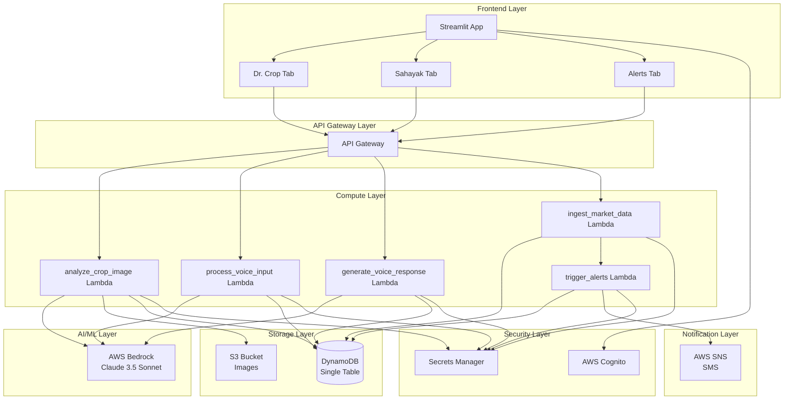
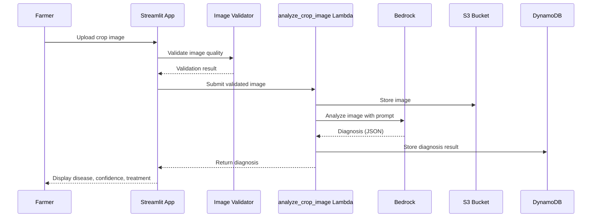
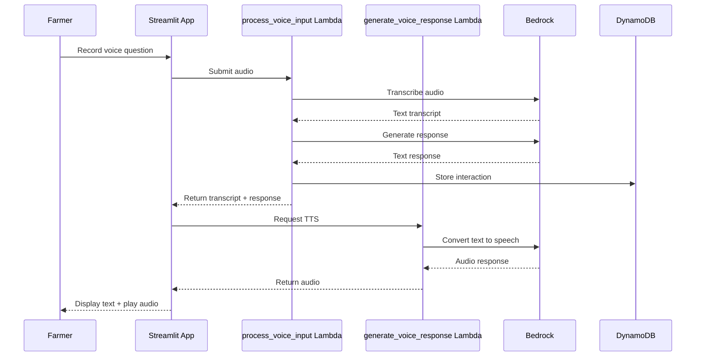
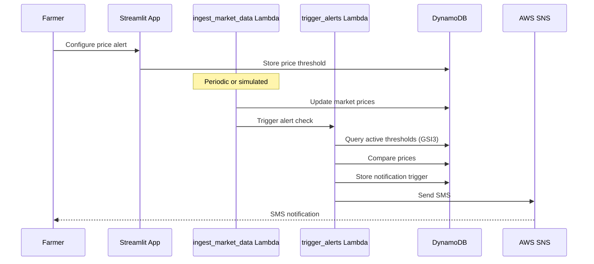

# Design Document: Agri-Nexus V1 Platform

## Overview

The Agri-Nexus V1 Platform is a comprehensive agricultural assistance application that combines AI-powered crop disease diagnosis, voice-based farmer assistance, and proactive market price alerts. The system is built on a serverless AWS architecture with a Python Streamlit frontend, providing farmers with an accessible, vernacular-first interface for critical agricultural decision-making.

### Core Capabilities

1. **Dr. Crop**: AI-powered crop disease diagnosis using computer vision and AWS Bedrock Claude 3.5 Sonnet
2. **Sahayak**: Voice-based assistant with speech-to-text and text-to-speech capabilities for farmer queries
3. **Alerts**: Configurable price alert system with SMS notifications via AWS SNS

### Technology Stack

- **Frontend**: Python Streamlit web application
- **AI/ML**: AWS Bedrock (Claude 3.5 Sonnet model)
- **Compute**: AWS Lambda functions
- **Storage**: AWS DynamoDB (single-table design)
- **Notifications**: AWS SNS for SMS delivery
- **Authentication**: AWS Cognito
- **Infrastructure**: AWS CDK/CloudFormation
- **Monitoring**: AWS CloudWatch

### Design Principles

1. **Vernacular-First**: Multilingual support (English, Bengali, Hindi) with local language as the primary interface
2. **Serverless Architecture**: Fully serverless backend for scalability and cost-efficiency
3. **Single-Table Design**: DynamoDB single-table pattern with GSI indexes for optimal query performance
4. **Separation of Concerns**: Clear boundaries between presentation (Streamlit), business logic (Lambda), and data (DynamoDB)
5. **Resilience**: Comprehensive error handling, retry logic, and graceful degradation

## Architecture

### High-Level Architecture



### Data Flow Patterns

#### Dr. Crop Flow


#### Sahayak Flow


#### Alert Flow


## Components and Interfaces

### Frontend Components

#### Streamlit Application (`streamlit_app.py`)

**Responsibilities**:
- Render three-tab interface (Dr. Crop, Sahayak, Alerts)
- Handle user authentication via Cognito
- Manage session state and navigation
- Display loading indicators and error messages
- Support multilingual interface (English, Bengali, Hindi)

**Key Methods**:
```python
def main():
    """Main application entry point with authentication check"""
    
def render_dr_crop_tab():
    """Render crop disease diagnosis interface"""
    
def render_sahayak_tab():
    """Render voice assistant interface"""
    
def render_alerts_tab():
    """Render price alert configuration interface"""
    
def switch_language(language_code: str):
    """Update UI language dynamically"""
```

**Configuration**:
- Environment variables: `AWS_REGION`, `TABLE_NAME`, `IMAGE_BUCKET`, `API_GATEWAY_URL`
- Session timeout: 30 minutes
- Max image size: 10 MB
- Max audio duration: 60 seconds

#### Image Validator (`image_validator.py`)

**Responsibilities**:
- Validate image format (JPEG, PNG, JPG)
- Check minimum resolution (224x224 pixels)
- Verify image integrity (not corrupted)
- Assess brightness and contrast
- Compress images before upload

**Key Methods**:
```python
def validate_image(image_bytes: bytes) -> ValidationResult:
    """Validate image quality and format"""
    
def check_resolution(image: PIL.Image) -> bool:
    """Verify minimum resolution requirements"""
    
def check_brightness_contrast(image: PIL.Image) -> bool:
    """Assess image quality metrics"""
    
def compress_image(image: PIL.Image, max_size_mb: int = 10) -> bytes:
    """Compress image while maintaining quality"""
```

**Validation Rules**:
- Minimum resolution: 224x224 pixels
- Supported formats: JPEG, PNG, JPG
- Maximum file size: 10 MB
- Brightness range: 20-235 (on 0-255 scale)
- Minimum contrast: 30

### Backend Components

#### Dr. Crop Service (`analyze_crop_image` Lambda)

**Responsibilities**:
- Receive validated crop images
- Store images in S3 bucket
- Construct structured prompts for Bedrock
- Invoke Bedrock Claude 3.5 Sonnet for diagnosis
- Parse and validate JSON responses
- Store diagnosis results in DynamoDB
- Return structured diagnosis to frontend

**Handler Signature**:
```python
def lambda_handler(event: dict, context: LambdaContext) -> dict:
    """
    Input: {
        "user_id": str,
        "image_data": str (base64),
        "language": str
    }
    Output: {
        "diagnosis_id": str,
        "disease_name": str,
        "confidence": float,
        "treatment": str,
        "timestamp": str
    }
    """
```

**Bedrock Prompt Template**:
```
You are an expert agricultural pathologist. Analyze the provided crop image and diagnose any diseases.

Return your response in the following JSON format:
{
  "disease_name": "Name of the disease or 'Healthy' if no disease detected",
  "confidence": <percentage between 0 and 100>,
  "treatment": "Detailed treatment recommendation"
}

Provide the response in {language}.
```

**DynamoDB Schema**:
- PK: `USER#<user_id>`
- SK: `DIAGNOSIS#<timestamp>`
- Attributes: `disease_name`, `confidence`, `treatment`, `image_s3_key`, `language`

#### Sahayak Service (`process_voice_input` and `generate_voice_response` Lambdas)

**process_voice_input Responsibilities**:
- Receive audio recording from frontend
- Transcribe audio using Bedrock
- Process transcribed text to understand intent
- Generate contextual response using Bedrock
- Store interaction in DynamoDB
- Return transcript and text response

**Handler Signature**:
```python
def lambda_handler(event: dict, context: LambdaContext) -> dict:
    """
    Input: {
        "user_id": str,
        "audio_data": str (base64),
        "language": str
    }
    Output: {
        "interaction_id": str,
        "transcript": str,
        "response_text": str,
        "timestamp": str
    }
    """
```

**generate_voice_response Responsibilities**:
- Receive text response
- Convert text to speech using Bedrock
- Return audio data

**Handler Signature**:
```python
def lambda_handler(event: dict, context: LambdaContext) -> dict:
    """
    Input: {
        "text": str,
        "language": str
    }
    Output: {
        "audio_data": str (base64),
        "duration_seconds": float
    }
    """
```

**DynamoDB Schema**:
- PK: `USER#<user_id>`
- SK: `INTERACTION#<timestamp>`
- Attributes: `transcript`, `response_text`, `language`, `audio_s3_key`

#### Alert Service (`ingest_market_data` and `trigger_alerts` Lambdas)

**ingest_market_data Responsibilities**:
- Receive market price updates (real or simulated)
- Store market data in DynamoDB
- Trigger alert checking process
- Support simulation mode for testing

**Handler Signature**:
```python
def lambda_handler(event: dict, context: LambdaContext) -> dict:
    """
    Input: {
        "crop_type": str,
        "location": str,
        "price": float,
        "timestamp": str,
        "simulation": bool
    }
    Output: {
        "market_data_id": str,
        "alerts_triggered": int
    }
    """
```

**trigger_alerts Responsibilities**:
- Query active price thresholds using GSI3
- Compare current prices against thresholds
- Create notification trigger events
- Send SMS via SNS
- Implement deduplication to prevent duplicate alerts
- Retry failed SMS deliveries with exponential backoff

**Handler Signature**:
```python
def lambda_handler(event: dict, context: LambdaContext) -> dict:
    """
    Input: {
        "crop_type": str,
        "location": str,
        "current_price": float
    }
    Output: {
        "alerts_triggered": int,
        "notifications_sent": int,
        "failures": list
    }
    """
```

**DynamoDB Schema for Price Thresholds**:
- PK: `USER#<user_id>`
- SK: `PRICE_TARGET#<crop_type>#<location>`
- GSI3PK: `ALERT#ACTIVE`
- GSI3SK: `<target_price>#<timestamp>`
- Attributes: `crop_type`, `location`, `target_price`, `phone_number`, `language`

**DynamoDB Schema for Market Data**:
- PK: `MARKET#<crop_type>`
- SK: `LOCATION#<location>#<timestamp>`
- GSI2PK: `<crop_type>`
- GSI2SK: `<location>#<timestamp>`
- Attributes: `price`, `timestamp`, `source`

**DynamoDB Schema for Notification Triggers**:
- PK: `USER#<user_id>`
- SK: `NOTIFICATION#<timestamp>`
- GSI3PK: `ALERT#TRIGGERED`
- GSI3SK: `<timestamp>`
- Attributes: `crop_type`, `target_price`, `current_price`, `sms_status`, `retry_count`

### Integration Components

#### Bedrock Client (`bedrock_client.py`)

**Responsibilities**:
- Manage AWS Bedrock API connections
- Handle model invocations with appropriate parameters
- Implement retry logic with exponential backoff
- Handle rate limiting errors
- Support multiple operation types (image analysis, transcription, text generation, TTS)

**Key Methods**:
```python
def analyze_image(image_bytes: bytes, prompt: str, language: str) -> dict:
    """Analyze crop image and return diagnosis"""
    
def transcribe_audio(audio_bytes: bytes, language: str) -> str:
    """Convert speech to text"""
    
def generate_response(prompt: str, context: str, language: str) -> str:
    """Generate contextual text response"""
    
def text_to_speech(text: str, language: str) -> bytes:
    """Convert text to speech audio"""
```

**Configuration**:
- Model ID: `anthropic.claude-3-5-sonnet-20241022-v2:0`
- Temperature: 0.3 (for consistent diagnostic outputs)
- Max tokens: 2048
- Retry attempts: 3
- Backoff multiplier: 2

#### DynamoDB Repository (`dynamodb_repository.py`)

**Responsibilities**:
- Abstract DynamoDB operations
- Implement single-table design patterns
- Manage GSI queries
- Handle pagination for large result sets
- Implement optimistic locking for concurrent updates

**Key Methods**:
```python
def store_diagnosis(user_id: str, diagnosis: dict) -> str:
    """Store diagnosis result"""
    
def get_diagnosis_history(user_id: str, limit: int = 20) -> list:
    """Retrieve diagnosis history"""
    
def store_interaction(user_id: str, interaction: dict) -> str:
    """Store voice interaction"""
    
def store_price_threshold(user_id: str, threshold: dict) -> str:
    """Store price alert configuration"""
    
def get_active_thresholds(crop_type: str, location: str) -> list:
    """Query active price thresholds using GSI3"""
    
def store_market_data(market_data: dict) -> str:
    """Store market price data"""
    
def get_latest_price(crop_type: str, location: str) -> dict:
    """Get latest price using GSI2"""
    
def store_notification_trigger(user_id: str, trigger: dict) -> str:
    """Store notification trigger event"""
```

**Table Schema**:
```
Table: agri-nexus-data
- PK (String): Partition key
- SK (String): Sort key
- GSI1PK (String): Admin dashboard queries
- GSI1SK (String): Status or timestamp
- GSI2PK (String): Market data queries
- GSI2SK (String): Location and timestamp
- GSI3PK (String): Alert processing
- GSI3SK (String): Target price and timestamp
- Attributes: JSON document with entity-specific fields
```

#### SNS Client (`sns_client.py`)

**Responsibilities**:
- Send SMS notifications
- Format messages for different languages
- Handle delivery failures
- Implement retry logic with exponential backoff
- Track delivery status

**Key Methods**:
```python
def send_sms(phone_number: str, message: str, language: str) -> dict:
    """Send SMS notification"""
    
def format_alert_message(crop_type: str, target_price: float, 
                         current_price: float, language: str) -> str:
    """Format alert message in specified language"""
    
def retry_failed_sms(notification_id: str, max_retries: int = 3) -> dict:
    """Retry failed SMS delivery"""
```

**Message Templates**:
```
English: "Price Alert: {crop_type} has reached ₹{current_price}/quintal at {location}. Your target was ₹{target_price}."
Bengali: "মূল্য সতর্কতা: {crop_type} {location} এ ₹{current_price}/কুইন্টাল পৌঁছেছে। আপনার লক্ষ্য ছিল ₹{target_price}।"
Hindi: "मूल्य अलर्ट: {crop_type} {location} में ₹{current_price}/क्विंटल तक पहुंच गया है। आपका लक्ष्य ₹{target_price} था।"
```

## Data Models

### Single-Table Design

The application uses a single DynamoDB table with multiple access patterns supported by GSI indexes.

#### Access Patterns

1. **Get user's diagnosis history**: Query by PK=`USER#<user_id>`, SK begins with `DIAGNOSIS#`
2. **Get user's voice interactions**: Query by PK=`USER#<user_id>`, SK begins with `INTERACTION#`
3. **Get user's price alerts**: Query by PK=`USER#<user_id>`, SK begins with `PRICE_TARGET#`
4. **Get user's notifications**: Query by PK=`USER#<user_id>`, SK begins with `NOTIFICATION#`
5. **Get all active alerts**: Query GSI3 by GSI3PK=`ALERT#ACTIVE`
6. **Get latest market price**: Query GSI2 by GSI2PK=`<crop_type>`, GSI2SK begins with `<location>#`
7. **Get triggered alerts**: Query GSI3 by GSI3PK=`ALERT#TRIGGERED`
8. **Admin dashboard**: Query GSI1 by GSI1PK=`<entity_type>`, GSI1SK for filtering

#### Entity Types

**Diagnosis Entity**:
```json
{
  "PK": "USER#farmer123",
  "SK": "DIAGNOSIS#2024-01-15T10:30:00Z",
  "GSI1PK": "DIAGNOSIS",
  "GSI1SK": "2024-01-15T10:30:00Z",
  "entity_type": "diagnosis",
  "disease_name": "Late Blight",
  "confidence": 87.5,
  "treatment": "Apply copper-based fungicide...",
  "image_s3_key": "images/farmer123/2024-01-15-103000.jpg",
  "language": "en",
  "created_at": "2024-01-15T10:30:00Z"
}
```

**Voice Interaction Entity**:
```json
{
  "PK": "USER#farmer123",
  "SK": "INTERACTION#2024-01-15T11:00:00Z",
  "GSI1PK": "INTERACTION",
  "GSI1SK": "2024-01-15T11:00:00Z",
  "entity_type": "interaction",
  "transcript": "What fertilizer should I use for wheat?",
  "response_text": "For wheat cultivation, use NPK fertilizer...",
  "audio_s3_key": "audio/farmer123/2024-01-15-110000.mp3",
  "language": "hi",
  "created_at": "2024-01-15T11:00:00Z"
}
```

**Price Threshold Entity**:
```json
{
  "PK": "USER#farmer123",
  "SK": "PRICE_TARGET#wheat#delhi",
  "GSI3PK": "ALERT#ACTIVE",
  "GSI3SK": "2500.00#2024-01-15T12:00:00Z",
  "entity_type": "price_threshold",
  "crop_type": "wheat",
  "location": "delhi",
  "target_price": 2500.00,
  "phone_number": "+919876543210",
  "language": "hi",
  "created_at": "2024-01-15T12:00:00Z",
  "status": "active"
}
```

**Market Data Entity**:
```json
{
  "PK": "MARKET#wheat",
  "SK": "LOCATION#delhi#2024-01-15T14:00:00Z",
  "GSI2PK": "wheat",
  "GSI2SK": "delhi#2024-01-15T14:00:00Z",
  "entity_type": "market_data",
  "crop_type": "wheat",
  "location": "delhi",
  "price": 2550.00,
  "source": "simulation",
  "timestamp": "2024-01-15T14:00:00Z"
}
```

**Notification Trigger Entity**:
```json
{
  "PK": "USER#farmer123",
  "SK": "NOTIFICATION#2024-01-15T14:05:00Z",
  "GSI3PK": "ALERT#TRIGGERED",
  "GSI3SK": "2024-01-15T14:05:00Z",
  "entity_type": "notification",
  "crop_type": "wheat",
  "location": "delhi",
  "target_price": 2500.00,
  "current_price": 2550.00,
  "sms_status": "delivered",
  "retry_count": 0,
  "created_at": "2024-01-15T14:05:00Z"
}
```

### Configuration Model

**Application Configuration**:
```python
@dataclass
class AppConfig:
    aws_region: str
    table_name: str
    image_bucket: str
    api_gateway_url: str
    bedrock_model_id: str = "anthropic.claude-3-5-sonnet-20241022-v2:0"
    bedrock_temperature: float = 0.3
    bedrock_max_tokens: int = 2048
    max_image_size_mb: int = 10
    max_audio_duration_sec: int = 60
    session_timeout_minutes: int = 30
    diagnosis_timeout_sec: int = 30
    voice_processing_timeout_sec: int = 15
    sms_delivery_timeout_sec: int = 60
    max_sms_retries: int = 3
    supported_languages: list = field(default_factory=lambda: ["en", "bn", "hi"])
```


### API Contracts

#### REST API Endpoints (via API Gateway)

**POST /api/v1/diagnose**
```json
Request:
{
  "user_id": "string",
  "image_data": "string (base64)",
  "language": "string (en|bn|hi)"
}

Response:
{
  "diagnosis_id": "string",
  "disease_name": "string",
  "confidence": "number (0-100)",
  "treatment": "string",
  "timestamp": "string (ISO 8601)"
}

Errors:
- 400: Invalid image format or quality
- 413: Image size exceeds limit
- 429: Rate limit exceeded
- 500: Internal server error
- 504: Diagnosis timeout
```

**POST /api/v1/voice/process**
```json
Request:
{
  "user_id": "string",
  "audio_data": "string (base64)",
  "language": "string (en|bn|hi)"
}

Response:
{
  "interaction_id": "string",
  "transcript": "string",
  "response_text": "string",
  "timestamp": "string (ISO 8601)"
}

Errors:
- 400: Invalid audio format or duration
- 429: Rate limit exceeded
- 500: Internal server error
- 504: Processing timeout
```

**POST /api/v1/voice/tts**
```json
Request:
{
  "text": "string",
  "language": "string (en|bn|hi)"
}

Response:
{
  "audio_data": "string (base64)",
  "duration_seconds": "number"
}

Errors:
- 400: Invalid text or language
- 429: Rate limit exceeded
- 500: Internal server error
```

**POST /api/v1/alerts/configure**
```json
Request:
{
  "user_id": "string",
  "crop_type": "string",
  "location": "string",
  "target_price": "number",
  "phone_number": "string",
  "language": "string (en|bn|hi)"
}

Response:
{
  "alert_id": "string",
  "status": "active",
  "created_at": "string (ISO 8601)"
}

Errors:
- 400: Invalid parameters
- 500: Internal server error
```

**GET /api/v1/alerts/list**
```json
Request Query Parameters:
- user_id: string

Response:
{
  "alerts": [
    {
      "alert_id": "string",
      "crop_type": "string",
      "location": "string",
      "target_price": "number",
      "status": "string",
      "created_at": "string (ISO 8601)"
    }
  ]
}
```

**DELETE /api/v1/alerts/{alert_id}**
```json
Response:
{
  "status": "deleted",
  "alert_id": "string"
}

Errors:
- 404: Alert not found
- 500: Internal server error
```

**POST /api/v1/market/simulate**
```json
Request:
{
  "crop_type": "string",
  "location": "string",
  "price": "number",
  "simulation": true
}

Response:
{
  "market_data_id": "string",
  "alerts_triggered": "number",
  "timestamp": "string (ISO 8601)"
}
```

**GET /api/v1/history/diagnoses**
```json
Request Query Parameters:
- user_id: string
- limit: number (default: 20)

Response:
{
  "diagnoses": [
    {
      "diagnosis_id": "string",
      "disease_name": "string",
      "confidence": "number",
      "treatment": "string",
      "timestamp": "string (ISO 8601)"
    }
  ],
  "next_token": "string (optional)"
}
```


## Correctness Properties

*A property is a characteristic or behavior that should hold true across all valid executions of a system-essentially, a formal statement about what the system should do. Properties serve as the bridge between human-readable specifications and machine-verifiable correctness guarantees.*

### Property 1: Tab Navigation Consistency

*For any* tab selection in the Streamlit application, clicking on that tab should display the corresponding feature interface and maintain the navigation state across subsequent user interactions.

**Validates: Requirements 1.3, 1.4**

### Property 2: Image Format Validation

*For any* uploaded file, the application should accept files with JPEG, PNG, or JPG extensions and reject all other formats with an error message in the user's preferred language.

**Validates: Requirements 2.2, 2.5**

### Property 3: Image Size Validation

*For any* uploaded image, files under 10 MB should be accepted (assuming other criteria are met) and files over 10 MB should be rejected.

**Validates: Requirements 2.4**

### Property 4: Image Quality Validation

*For any* uploaded image, the Image_Validator should verify that resolution is at least 224x224 pixels, brightness and contrast are within acceptable ranges, and return either a validation success indicator or a descriptive error message accordingly.

**Validates: Requirements 3.1, 3.3, 3.4, 3.5**

### Property 5: Image Preview Display

*For any* valid uploaded image, the Streamlit application should display a preview of that image.

**Validates: Requirements 2.3**

### Property 6: Diagnosis Result Structure

*For any* completed diagnosis, the Dr_Crop_Service should return a Diagnosis_Result containing disease name, confidence percentage (between 0 and 100), and treatment recommendation, and the Streamlit_App should display all three fields.

**Validates: Requirements 4.3, 4.4, 4.5**

### Property 7: Diagnosis Persistence

*For any* completed diagnosis, the Dr_Crop_Service should store the result in DynamoDB with user ID, timestamp, image reference, disease name, confidence score, and treatment recommendation.

**Validates: Requirements 6.1, 6.2**

### Property 8: DynamoDB Key Structure

*For any* entity stored in DynamoDB, the partition key and sort key should follow the defined patterns: diagnoses use `USER#<userId>` and `DIAGNOSIS#<timestamp>`, price targets use `USER#<userId>` and `PRICE_TARGET#<cropType>#<location>`, and GSI keys should follow their respective patterns (GSI1PK for entity type, GSI2PK for crop type, GSI3PK for alert status).

**Validates: Requirements 6.3, 9.6, 16.3, 16.4, 16.5**

### Property 9: Diagnosis History Ordering

*For any* set of diagnoses for a user, the Streamlit application should display them in reverse chronological order (most recent first).

**Validates: Requirements 6.4**

### Property 10: Diagnosis History Pagination

*For any* user with more than 20 diagnoses, the Streamlit application should display only the most recent 20 diagnoses.

**Validates: Requirements 6.5**

### Property 11: Audio Duration Limit

*For any* voice recording, the Streamlit application should limit the recording duration to 60 seconds.

**Validates: Requirements 7.4**

### Property 12: Audio Playback Control

*For any* completed voice recording, the Streamlit application should display a playback control for that recorded audio.

**Validates: Requirements 7.5**

### Property 13: Voice Processing Pipeline

*For any* submitted voice recording, the Sahayak_Service should transcribe the audio, generate a contextual response, convert the response to speech, and return the transcript, text response, and audio playback control.

**Validates: Requirements 8.1, 8.3, 8.4, 8.5**

### Property 14: Price Alert Persistence

*For any* submitted price alert configuration, the Alert_Service should store the Price_Threshold in DynamoDB with the correct key structure.

**Validates: Requirements 9.5, 9.6**

### Property 15: Active Alerts Display

*For any* user with active price alerts, the Streamlit application should display all alerts with crop type, target price, location, and creation date, and provide a delete button for each alert.

**Validates: Requirements 10.1, 10.2, 10.3**

### Property 16: Alert Deletion

*For any* delete action on a price alert, the Alert_Service should remove the Price_Threshold from DynamoDB and the Streamlit application should refresh the alert list to reflect the current state.

**Validates: Requirements 10.4, 10.5**

### Property 17: Price Comparison Logic

*For any* market price update and any active price threshold, the Alert_Service should compare the price against the threshold and identify thresholds where the price meets or exceeds the target.

**Validates: Requirements 11.3, 11.4**

### Property 18: Simulation Logging

*For any* price comparison in simulation mode, the Alert_Service should log the comparison for debugging purposes.

**Validates: Requirements 11.5**

### Property 19: Alert Trigger and Notification Pipeline

*For any* market price that meets or exceeds a price threshold, the Alert_Service should create a Notification_Trigger with user ID, crop type, target price, current price, and timestamp, store it in DynamoDB with GSI3 index, send it to SNS, and ensure each threshold is processed only once per price update.

**Validates: Requirements 12.1, 12.2, 12.3, 12.4, 12.5, 13.1**

### Property 20: SMS Message Format

*For any* SMS notification, the SNS_Client should format the message to include crop type, target price, and current price, and send it to the phone number associated with the user account.

**Validates: Requirements 13.2, 13.3**

### Property 21: SMS Retry Logic

*For any* failed SMS delivery, the Alert_Service should log the failure and retry up to 3 times with exponential backoff.

**Validates: Requirements 13.5**

### Property 22: Lambda Error Handling

*For any* Lambda function invocation failure, the Streamlit application should display a user-friendly error message and log technical details.

**Validates: Requirements 14.5**

### Property 23: Bedrock Rate Limit Handling

*For any* rate limiting error from Bedrock, the Bedrock_Client should apply exponential backoff retry logic.

**Validates: Requirements 15.5**

### Property 24: Configuration Validation

*For any* application startup, the Streamlit application should validate that required environment variables (AWS_REGION, TABLE_NAME, IMAGE_BUCKET, API_GATEWAY_URL) are present, use default values when variables are not set in development mode, and refuse to start with an error message if required configuration is missing in production mode.

**Validates: Requirements 17.2, 17.3, 17.4, 17.5**

### Property 25: Error Message Localization

*For any* error encountered by any service and any user-selected language, the Streamlit application should display a user-friendly error message in that language without technical stack traces, log detailed error information to CloudWatch, and provide actionable guidance when possible (e.g., suggesting to check internet connectivity for network errors).

**Validates: Requirements 18.1, 18.2, 18.3, 18.4, 18.5**

### Property 26: Language Switching

*For any* language change by the user, the Streamlit application should immediately update all interface labels and messages to the selected language.

**Validates: Requirements 19.3**

### Property 27: Service Response Localization

*For any* diagnosis result or voice interaction response and any user-selected language, the Dr_Crop_Service and Sahayak_Service should return results in that language.

**Validates: Requirements 19.4, 19.5**

### Property 28: Loading Indicator Display

*For any* operation that exceeds 2 seconds, the Streamlit application should display a loading indicator.

**Validates: Requirements 21.2**

### Property 29: Image Compression

*For any* uploaded image, the Streamlit application should compress the image before uploading to reduce bandwidth usage.

**Validates: Requirements 21.4**

### Property 30: Timeout Warning

*For any* operation where network latency exceeds 5 seconds, the Streamlit application should display a timeout warning.

**Validates: Requirements 21.5**

### Property 31: Authentication Enforcement

*For any* unauthenticated request to access application features, the Streamlit application should deny access and require user authentication.

**Validates: Requirements 22.1**

### Property 32: HTTPS Transmission

*For any* data transmission between the Streamlit application and backend services, the data should be transmitted over HTTPS encrypted connections.

**Validates: Requirements 22.3**

### Property 33: Session Timeout

*For any* user session with 30 minutes of inactivity, the Streamlit application should automatically log out the user.

**Validates: Requirements 22.5**

### Property 34: Metrics Emission

*For any* significant application event (page views, feature usage, errors, Lambda invocations, alert lifecycle events), the system should emit appropriate metrics to CloudWatch with required fields (request ID, duration, status for Lambda invocations).

**Validates: Requirements 24.1, 24.2, 24.3, 24.4**

### Property 35: Unstructured Response Parsing

*For any* unstructured response from Bedrock, the Dr_Crop_Service should attempt to parse and structure the response, and return an error if parsing fails after retry.

**Validates: Requirements 5.4**


## Error Handling

### Error Categories

#### 1. User Input Errors

**Scenarios**:
- Invalid image format or size
- Corrupted or low-quality images
- Invalid audio format or duration
- Invalid price alert parameters

**Handling Strategy**:
- Validate inputs at the frontend before submission
- Display clear, actionable error messages in user's language
- Provide guidance on how to correct the issue
- Log validation failures for analytics

**Example Error Messages**:
```
English: "Image quality is too low. Please upload a clearer photo with good lighting."
Bengali: "ছবির গুণমান খুব কম। ভাল আলো সহ একটি পরিষ্কার ফটো আপলোড করুন।"
Hindi: "छवि की गुणवत्ता बहुत कम है। कृपया अच्छी रोशनी के साथ एक स्पष्ट फोटो अपलोड करें।"
```

#### 2. Service Integration Errors

**Scenarios**:
- Bedrock API failures (rate limiting, timeouts, model errors)
- Lambda invocation failures
- DynamoDB operation failures
- SNS delivery failures

**Handling Strategy**:
- Implement exponential backoff retry logic (3 attempts)
- Graceful degradation where possible
- Display user-friendly error messages
- Log detailed technical information to CloudWatch
- Track error metrics for monitoring

**Retry Configuration**:
```python
retry_config = {
    "max_attempts": 3,
    "base_delay": 1.0,  # seconds
    "max_delay": 10.0,  # seconds
    "exponential_base": 2,
    "jitter": True
}
```

#### 3. Network Errors

**Scenarios**:
- Connection timeouts
- DNS resolution failures
- SSL/TLS errors
- High latency (>5 seconds)

**Handling Strategy**:
- Display timeout warnings for operations exceeding thresholds
- Suggest checking internet connectivity
- Implement request timeouts at appropriate levels
- Cache responses where applicable
- Provide offline indicators

**Timeout Configuration**:
```python
timeouts = {
    "diagnosis": 30,  # seconds
    "voice_processing": 15,  # seconds
    "sms_delivery": 60,  # seconds
    "api_request": 10,  # seconds
}
```

#### 4. Authentication and Authorization Errors

**Scenarios**:
- Unauthenticated access attempts
- Expired sessions
- Invalid tokens
- Insufficient permissions

**Handling Strategy**:
- Redirect to login page for unauthenticated requests
- Clear session data on expiration
- Refresh tokens automatically when possible
- Display clear authentication error messages
- Log security events for audit

#### 5. Data Consistency Errors

**Scenarios**:
- Concurrent updates to same entity
- Missing required fields
- Invalid data formats
- Orphaned references

**Handling Strategy**:
- Implement optimistic locking for concurrent updates
- Validate data schemas before storage
- Use transactions where atomicity is required
- Implement data validation at multiple layers
- Regular data integrity checks

#### 6. Resource Limit Errors

**Scenarios**:
- DynamoDB throttling
- Lambda concurrent execution limits
- S3 storage limits
- Bedrock quota exhaustion

**Handling Strategy**:
- Implement backoff and retry for throttling
- Monitor resource utilization
- Set up CloudWatch alarms for approaching limits
- Implement request queuing where appropriate
- Display capacity warnings to users

### Error Response Format

All API endpoints return errors in a consistent format:

```json
{
  "error": {
    "code": "string",
    "message": "string (user-friendly, localized)",
    "details": "string (technical details, optional)",
    "request_id": "string",
    "timestamp": "string (ISO 8601)"
  }
}
```

### Error Codes

| Code | Description | HTTP Status | Retry |
|------|-------------|-------------|-------|
| INVALID_IMAGE_FORMAT | Unsupported image format | 400 | No |
| IMAGE_TOO_LARGE | Image exceeds size limit | 413 | No |
| IMAGE_QUALITY_LOW | Image quality insufficient | 400 | No |
| INVALID_AUDIO_FORMAT | Unsupported audio format | 400 | No |
| AUDIO_TOO_LONG | Audio exceeds duration limit | 400 | No |
| DIAGNOSIS_FAILED | AI diagnosis failed | 500 | Yes |
| TRANSCRIPTION_FAILED | Audio transcription failed | 500 | Yes |
| TTS_FAILED | Text-to-speech failed | 500 | Yes |
| STORAGE_FAILED | Database operation failed | 500 | Yes |
| SMS_DELIVERY_FAILED | SMS notification failed | 500 | Yes |
| RATE_LIMIT_EXCEEDED | Too many requests | 429 | Yes |
| AUTHENTICATION_REQUIRED | User not authenticated | 401 | No |
| SESSION_EXPIRED | User session expired | 401 | No |
| NETWORK_TIMEOUT | Request timed out | 504 | Yes |
| INVALID_CONFIGURATION | Missing or invalid config | 500 | No |

### Logging Strategy

**Log Levels**:
- **ERROR**: Service failures, unhandled exceptions, data corruption
- **WARN**: Retry attempts, degraded performance, approaching limits
- **INFO**: Successful operations, state changes, user actions
- **DEBUG**: Detailed execution flow, variable values (dev only)

**Log Structure**:
```json
{
  "timestamp": "2024-01-15T10:30:00Z",
  "level": "ERROR",
  "service": "dr_crop_service",
  "request_id": "abc123",
  "user_id": "farmer123",
  "operation": "analyze_image",
  "message": "Bedrock API call failed",
  "error": {
    "type": "RateLimitException",
    "message": "Rate limit exceeded",
    "stack_trace": "..."
  },
  "context": {
    "image_size": 2048576,
    "model_id": "anthropic.claude-3-5-sonnet-20241022-v2:0",
    "attempt": 2
  }
}
```

## Testing Strategy

### Overview

The testing strategy employs a dual approach combining unit tests for specific scenarios and property-based tests for comprehensive input coverage. This ensures both concrete examples work correctly and universal properties hold across all inputs.

### Testing Layers

#### 1. Unit Tests

**Purpose**: Verify specific examples, edge cases, and integration points.

**Scope**:
- Image validation with specific test images (valid, invalid format, corrupted, low quality)
- Diagnosis response parsing with example JSON structures
- Error message formatting in all supported languages
- DynamoDB key construction with specific inputs
- SMS message formatting with example data
- Configuration loading with various environment variable combinations
- Authentication flow with valid and invalid credentials

**Example Unit Tests**:
```python
def test_image_validator_rejects_invalid_format():
    """Test that .txt files are rejected"""
    validator = ImageValidator()
    result = validator.validate_image(b"text content", "file.txt")
    assert result.is_valid == False
    assert "format" in result.error_message.lower()

def test_diagnosis_result_contains_required_fields():
    """Test that diagnosis result has all required fields"""
    result = {
        "disease_name": "Late Blight",
        "confidence": 87.5,
        "treatment": "Apply fungicide"
    }
    assert "disease_name" in result
    assert "confidence" in result
    assert "treatment" in result
    assert 0 <= result["confidence"] <= 100

def test_sms_message_format_english():
    """Test SMS message formatting in English"""
    message = format_alert_message(
        crop_type="wheat",
        target_price=2500.0,
        current_price=2550.0,
        location="delhi",
        language="en"
    )
    assert "wheat" in message
    assert "2500" in message
    assert "2550" in message
```

**Edge Cases to Test**:
- Empty or whitespace-only inputs
- Boundary values (exactly 10MB image, exactly 60 second audio)
- Corrupted data (malformed JSON, truncated images)
- Missing optional fields
- Concurrent operations on same entity
- Network interruptions mid-operation
- Rate limit scenarios

#### 2. Property-Based Tests

**Purpose**: Verify universal properties hold across all inputs through randomized testing.

**Library**: Use `hypothesis` for Python property-based testing.

**Configuration**:
- Minimum 100 iterations per property test
- Each test tagged with feature name and property number
- Seed-based reproducibility for failed tests

**Property Test Examples**:

```python
from hypothesis import given, strategies as st

@given(
    image_data=st.binary(min_size=1000, max_size=10*1024*1024),
    format=st.sampled_from(["jpg", "jpeg", "png"])
)
def test_property_valid_images_accepted(image_data, format):
    """
    Feature: agri-nexus-v1-platform, Property 2: Image Format Validation
    For any uploaded file with valid format, it should be accepted
    """
    validator = ImageValidator()
    # Create valid image from binary data
    image = create_test_image(image_data, format)
    result = validator.validate_image(image, f"test.{format}")
    assert result.is_valid == True

@given(
    diagnoses=st.lists(
        st.fixed_dictionaries({
            "disease_name": st.text(min_size=1),
            "confidence": st.floats(min_value=0, max_value=100),
            "treatment": st.text(min_size=1),
            "timestamp": st.datetimes()
        }),
        min_size=1,
        max_size=50
    )
)
def test_property_diagnosis_history_ordering(diagnoses):
    """
    Feature: agri-nexus-v1-platform, Property 9: Diagnosis History Ordering
    For any set of diagnoses, they should be displayed in reverse chronological order
    """
    # Store diagnoses
    for diagnosis in diagnoses:
        store_diagnosis("test_user", diagnosis)
    
    # Retrieve history
    history = get_diagnosis_history("test_user")
    
    # Verify reverse chronological order
    timestamps = [d["timestamp"] for d in history]
    assert timestamps == sorted(timestamps, reverse=True)

@given(
    crop_type=st.text(min_size=1, max_size=50),
    location=st.text(min_size=1, max_size=50),
    target_price=st.floats(min_value=0.01, max_value=100000),
    current_price=st.floats(min_value=0.01, max_value=100000)
)
def test_property_alert_trigger_logic(crop_type, location, target_price, current_price):
    """
    Feature: agri-nexus-v1-platform, Property 17: Price Comparison Logic
    For any price >= target, alert should be triggered
    """
    # Create price threshold
    threshold = create_price_threshold("test_user", crop_type, location, target_price)
    
    # Update market price
    update_market_price(crop_type, location, current_price)
    
    # Check if alert was triggered
    alerts = get_triggered_alerts("test_user")
    
    if current_price >= target_price:
        assert len(alerts) > 0
        assert alerts[0]["crop_type"] == crop_type
        assert alerts[0]["current_price"] == current_price
    else:
        assert len(alerts) == 0

@given(
    user_id=st.text(min_size=1, max_size=50),
    timestamp=st.datetimes(),
    crop_type=st.text(min_size=1, max_size=50)
)
def test_property_dynamodb_key_structure(user_id, timestamp, crop_type):
    """
    Feature: agri-nexus-v1-platform, Property 8: DynamoDB Key Structure
    For any diagnosis, keys should follow the defined pattern
    """
    diagnosis = {
        "disease_name": "Test Disease",
        "confidence": 85.0,
        "treatment": "Test Treatment"
    }
    
    diagnosis_id = store_diagnosis(user_id, diagnosis, timestamp)
    
    # Retrieve from DynamoDB
    item = get_dynamodb_item(diagnosis_id)
    
    assert item["PK"] == f"USER#{user_id}"
    assert item["SK"].startswith("DIAGNOSIS#")
    assert timestamp.isoformat() in item["SK"]

@given(
    language=st.sampled_from(["en", "bn", "hi"]),
    error_type=st.sampled_from([
        "INVALID_IMAGE_FORMAT",
        "IMAGE_TOO_LARGE",
        "NETWORK_TIMEOUT"
    ])
)
def test_property_error_message_localization(language, error_type):
    """
    Feature: agri-nexus-v1-platform, Property 25: Error Message Localization
    For any error and any language, message should be in that language
    """
    error_message = get_error_message(error_type, language)
    
    # Verify message is not empty
    assert len(error_message) > 0
    
    # Verify no stack traces in user message
    assert "Traceback" not in error_message
    assert "Exception" not in error_message
    
    # Verify actionable guidance for network errors
    if error_type == "NETWORK_TIMEOUT":
        assert any(keyword in error_message.lower() 
                  for keyword in ["internet", "connection", "network"])

@given(
    retries=st.integers(min_value=0, max_value=5)
)
def test_property_sms_retry_logic(retries):
    """
    Feature: agri-nexus-v1-platform, Property 21: SMS Retry Logic
    For any failed SMS, retries should occur up to 3 times
    """
    notification = create_notification_trigger("test_user", "wheat", 2500, 2550)
    
    # Simulate failures
    for i in range(retries):
        result = attempt_sms_delivery(notification)
        if i < 3:
            # Should retry
            assert result["retry_count"] == i + 1
        else:
            # Should stop retrying after 3 attempts
            assert result["retry_count"] == 3
            assert result["status"] == "failed"
```

**Property Test Coverage**:
- All 35 correctness properties defined in the design document
- Each property implemented as a single property-based test
- Minimum 100 iterations per test
- Tagged with feature name and property number

#### 3. Integration Tests

**Purpose**: Verify end-to-end workflows across multiple components.

**Scenarios**:
- Complete Dr. Crop flow: upload image → validate → diagnose → store → display
- Complete Sahayak flow: record audio → transcribe → generate response → TTS → display
- Complete Alert flow: configure alert → update price → trigger → send SMS → verify delivery
- Authentication flow: login → access features → session timeout → re-authenticate
- Language switching: change language → verify all UI updates → verify service responses

**Example Integration Test**:
```python
def test_happy_path_dr_crop():
    """Test complete Dr. Crop diagnosis flow"""
    # Setup
    user = authenticate_user("test_farmer", "password")
    image = load_test_image("late_blight_sample.jpg")
    
    # Upload and validate
    upload_result = upload_image(user.id, image)
    assert upload_result["status"] == "success"
    
    # Diagnose
    diagnosis = request_diagnosis(user.id, upload_result["image_id"])
    assert "disease_name" in diagnosis
    assert "confidence" in diagnosis
    assert "treatment" in diagnosis
    assert 0 <= diagnosis["confidence"] <= 100
    
    # Verify storage
    history = get_diagnosis_history(user.id)
    assert len(history) > 0
    assert history[0]["disease_name"] == diagnosis["disease_name"]
    
    # Verify display
    ui_content = render_diagnosis_result(diagnosis)
    assert diagnosis["disease_name"] in ui_content
    assert str(diagnosis["confidence"]) in ui_content
    assert diagnosis["treatment"] in ui_content
```

#### 4. Performance Tests

**Purpose**: Verify system meets performance requirements.

**Metrics**:
- Initial page load time (<3 seconds on 3G)
- Diagnosis completion time (<30 seconds)
- Voice processing time (<15 seconds)
- SMS delivery time (<60 seconds)
- API response times (<10 seconds)

**Tools**: Use `locust` or `artillery` for load testing.

#### 5. Security Tests

**Purpose**: Verify security controls are effective.

**Scenarios**:
- Unauthenticated access attempts (should be blocked)
- SQL injection attempts (should be prevented)
- XSS attempts (should be sanitized)
- CSRF attacks (should be prevented)
- Session hijacking (should be detected)
- Data encryption in transit (HTTPS verification)

### Test Environment Setup

**Local Development**:
- Use LocalStack for AWS service mocking
- Mock Bedrock responses with predefined outputs
- Use in-memory DynamoDB for fast tests
- Mock SNS to prevent actual SMS sending

**CI/CD Pipeline**:
- Run unit tests on every commit
- Run property tests on every pull request
- Run integration tests before deployment
- Run performance tests weekly
- Generate coverage reports (target: >80%)

**Test Data**:
- Curated set of crop disease images (healthy and diseased)
- Sample audio recordings in all supported languages
- Mock market price data
- Test user accounts with various configurations

### Continuous Testing

**Monitoring in Production**:
- Synthetic transactions to verify core flows
- Real user monitoring (RUM) for performance
- Error rate tracking and alerting
- A/B testing for new features

**Regression Testing**:
- Automated regression suite runs nightly
- Includes all critical user journeys
- Alerts on any failures
- Tracks test execution trends

