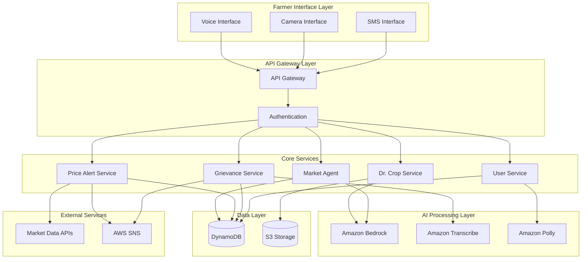

# Design Document: Agri-Nexus Multimodal AI Platform

## Overview

Agri-Nexus is designed as a serverless, event-driven multimodal AI platform built on AWS services. The system follows a microservices architecture with clear separation of concerns, enabling independent scaling and maintenance of different capabilities. The platform leverages AWS Bedrock for AI processing, DynamoDB for data persistence, and AWS communication services for farmer interactions.

The design prioritizes resilience, multilingual support, and offline capability to serve farmers in rural areas with intermittent connectivity. All components are designed to handle the unique challenges of agricultural workflows, including seasonal patterns, regional variations, and the need for real-time decision support.

## Architecture

### High-Level Architecture



### Service Architecture Patterns

**Event-Driven Architecture**: All services communicate through events, enabling loose coupling and independent scaling. AWS EventBridge orchestrates inter-service communication.

**CQRS Pattern**: Read and write operations are separated, with optimized data models for each access pattern using DynamoDB's single-table design.

**Circuit Breaker Pattern**: External service calls (market data, AI services) implement circuit breakers to handle failures gracefully.

## Components and Interfaces

### 1. Dr. Crop Service

**Purpose**: Computer vision-based crop disease diagnosis and treatment recommendation.

**Key Components**:
- Image preprocessing and validation
- Bedrock Claude 3.5 Sonnet integration for visual analysis
- Treatment database with multilingual content
- Diagnosis history tracking

**Interfaces**:
```typescript
interface DrCropService {
  analyzeCropImage(imageData: Buffer, farmerId: string, language: string): Promise<DiagnosisResult>
  getDiagnosisHistory(farmerId: string): Promise<DiagnosisRecord[]>
  validateImageQuality(imageData: Buffer): Promise<ImageQualityResult>
}

interface DiagnosisResult {
  diseaseIdentified: boolean
  diseaseName?: string
  confidence: number
  treatmentRecommendations: TreatmentStep[]
  preventiveMeasures: string[]
  followUpRequired: boolean
}
```

### 2. Market Agent Service

**Purpose**: Autonomous market intelligence providing pricing, trends, and government scheme information.

**Key Components**:
- Real-time market data aggregation
- Trend analysis and forecasting
- Government scheme database
- Personalized recommendation engine

**Interfaces**:
```typescript
interface MarketAgentService {
  getMarketIntelligence(cropType: string, location: string, farmerId: string): Promise<MarketIntelligence>
  analyzePortfolio(farmerId: string): Promise<PortfolioAnalysis>
  getGovernmentSchemes(farmerId: string, cropTypes: string[]): Promise<SchemeRecommendation[]>
  subscribeToMarketUpdates(farmerId: string, preferences: MarketPreferences): Promise<void>
}

interface MarketIntelligence {
  currentPrice: PriceData
  historicalTrends: TrendData[]
  forecast: PriceForecast
  marketInsights: string[]
  actionableRecommendations: Recommendation[]
}
```

### 3. Voice Interface Service

**Purpose**: Multilingual voice processing for farmer interactions.

**Key Components**:
- Amazon Transcribe integration for speech-to-text
- Amazon Polly integration for text-to-speech
- Intent recognition and natural language understanding
- Offline voice processing capability

**Interfaces**:
```typescript
interface VoiceInterfaceService {
  processVoiceInput(audioData: Buffer, language: string, farmerId: string): Promise<VoiceProcessingResult>
  generateVoiceResponse(text: string, language: string, voiceId: string): Promise<AudioBuffer>
  detectLanguage(audioData: Buffer): Promise<LanguageDetectionResult>
  processOfflineVoice(audioData: Buffer): Promise<OfflineProcessingResult>
}

interface VoiceProcessingResult {
  transcription: string
  intent: IntentClassification
  entities: EntityExtraction[]
  confidence: number
  requiresClarification: boolean
}
```

### 4. Price Alert Service

**Purpose**: Proactive SMS notifications based on farmer-defined price targets.

**Key Components**:
- Price target management
- Market data monitoring
- SMS notification engine
- Alert history and analytics

**Interfaces**:
```typescript
interface PriceAlertService {
  setPriceTarget(farmerId: string, cropType: string, targetPrice: number, alertType: AlertType): Promise<void>
  monitorPriceTargets(): Promise<void>
  sendPriceAlert(farmerId: string, alertData: PriceAlertData): Promise<void>
  getAlertHistory(farmerId: string): Promise<AlertRecord[]>
}

interface PriceAlertData {
  cropType: string
  currentPrice: number
  targetPrice: number
  priceChange: number
  marketTrend: string
  recommendedAction: string
}
```

### 5. Grievance Management Service

**Purpose**: Voice-based issue logging and structured ticket management.

**Key Components**:
- Voice-to-ticket conversion
- Automatic categorization and prioritization
- Workflow management
- Notification system

**Interfaces**:
```typescript
interface GrievanceService {
  createGrievanceFromVoice(audioData: Buffer, farmerId: string): Promise<GrievanceTicket>
  updateTicketStatus(ticketId: string, status: TicketStatus, adminId: string): Promise<void>
  getGrievanceHistory(farmerId: string): Promise<GrievanceTicket[]>
  categorizeGrievance(description: string): Promise<GrievanceCategory>
}

interface GrievanceTicket {
  ticketId: string
  farmerId: string
  category: GrievanceCategory
  priority: Priority
  description: string
  status: TicketStatus
  createdAt: Date
  updatedAt: Date
  resolutionNotes?: string
}
```

## Data Models

### Single Table Design Schema

The system uses DynamoDB single-table design to optimize for access patterns and reduce costs. All entities are stored in a single table with composite keys.

**Primary Key Structure**:
- Partition Key (PK): Entity type and identifier
- Sort Key (SK): Entity subtype or relationship identifier

**Entity Types**:

```typescript
// User Profile
PK: "USER#<farmerId>"
SK: "PROFILE"
{
  farmerId: string
  name: string
  phoneNumber: string
  language: string
  location: GeoLocation
  cropTypes: string[]
  landArea: number
  registrationDate: Date
  lastActive: Date
}

// Crop Diagnosis
PK: "USER#<farmerId>"
SK: "DIAGNOSIS#<timestamp>"
{
  diagnosisId: string
  imageUrl: string
  diseaseIdentified: string
  confidence: number
  treatmentRecommendations: TreatmentStep[]
  followUpRequired: boolean
  createdAt: Date
}

// Price Target
PK: "USER#<farmerId>"
SK: "PRICE_TARGET#<cropType>"
{
  targetId: string
  cropType: string
  targetPrice: number
  alertType: AlertType
  isActive: boolean
  createdAt: Date
  lastTriggered?: Date
}

// Market Data
PK: "MARKET#<cropType>#<location>"
SK: "PRICE#<timestamp>"
{
  cropType: string
  location: string
  price: number
  marketName: string
  quality: string
  timestamp: Date
  source: string
}

// Grievance Ticket
PK: "USER#<farmerId>"
SK: "GRIEVANCE#<ticketId>"
{
  ticketId: string
  category: GrievanceCategory
  priority: Priority
  description: string
  status: TicketStatus
  audioUrl?: string
  assignedTo?: string
  createdAt: Date
  updatedAt: Date
}
```

### Global Secondary Indexes

**GSI1**: Admin Dashboard Queries
- PK: Entity type (e.g., "GRIEVANCE", "DIAGNOSIS")
- SK: Status or timestamp for filtering

**GSI2**: Market Data Queries
- PK: Crop type
- SK: Location and timestamp for regional analysis

**GSI3**: Alert Processing
- PK: Alert type and status
- SK: Target price and timestamp for efficient monitoring

## Correctness Properties

*A property is a characteristic or behavior that should hold true across all valid executions of a system—essentially, a formal statement about what the system should do. Properties serve as the bridge between human-readable specifications and machine-verifiable correctness guarantees.*

Before defining the correctness properties, I need to analyze the acceptance criteria from the requirements document to determine which ones are testable as properties.

<function_calls>
<invoke name="prework">
<parameter name="featureName">agri-nexus

Based on the prework analysis, I'll now define the key correctness properties that validate the system's behavior:

**Property 1: Crop Image Analysis Completeness**
*For any* valid crop image uploaded by a farmer, the Dr_Crop service should return a structured diagnosis result containing disease identification, confidence score, and appropriate recommendations or preventive measures.
**Validates: Requirements 1.1, 1.4**

**Property 2: Multilingual Content Consistency**
*For any* system-generated content (treatment recommendations, price alerts, SMS notifications, voice responses), the content should be delivered in the farmer's preferred language with consistent terminology and proper localization.
**Validates: Requirements 1.2, 3.3, 4.3, 5.4, 10.5**

**Property 3: Data Persistence and Retrieval**
*For any* farmer data (diagnoses, price targets, grievances, profile information), storing the data should enable accurate retrieval with complete information and proper farmer association.
**Validates: Requirements 1.5, 4.1, 5.5, 7.3**

**Property 4: Market Data Location Specificity**
*For any* market information request with crop type and location parameters, the returned data should match the specified location and include relevant regional pricing and trends.
**Validates: Requirements 2.1, 6.5**

**Property 5: Proactive Notification Triggering**
*For any* price target or market condition that meets notification criteria, the system should send appropriate notifications to relevant farmers within the specified time limits.
**Validates: Requirements 2.2, 4.2**

**Property 6: Portfolio Analysis Relevance**
*For any* farmer's crop portfolio, optimization suggestions should be based on the farmer's actual crops, location, and current market conditions.
**Validates: Requirements 2.3**

**Property 7: Seasonal Data Enhancement**
*For any* request for major crop types (Potato, Rice, etc.), the response should include seasonal trends and demand forecasts in addition to current pricing.
**Validates: Requirements 2.4**

**Property 8: Data Anonymization in Aggregation**
*For any* aggregated market insights generated from multiple farmer requests, individual farmer information should be anonymized while providing meaningful market intelligence.
**Validates: Requirements 2.5**

**Property 9: Voice Processing Accuracy**
*For any* voice input in supported languages (Bengali, Hindi), the system should accurately transcribe speech, identify intent, and execute appropriate actions or request clarification when ambiguous.
**Validates: Requirements 3.1, 3.2, 5.1**

**Property 10: Offline Functionality Preservation**
*For any* basic system operation during offline mode, essential functionality should remain available with proper queuing of actions for later synchronization.
**Validates: Requirements 3.5, 8.1, 8.2, 8.4**

**Property 11: Alert Content Completeness**
*For any* price alert or notification sent to farmers, the message should include all required information (current price, target price, recommended action) in the appropriate format and language.
**Validates: Requirements 4.3**

**Property 12: Voice-Based Management Operations**
*For any* voice command to modify price targets or update profile information, the system should correctly interpret the request and apply the changes with voice confirmation.
**Validates: Requirements 4.5, 7.4**

**Property 13: Ticket Creation and Categorization**
*For any* voice-based grievance report, the system should create a structured ticket with appropriate categorization, priority assignment, and reference number generation.
**Validates: Requirements 5.2, 5.3**

**Property 14: Market Data Integration Timing**
*For any* market data update cycle during market hours, price information should be refreshed at the specified intervals with proper validation for anomalies.
**Validates: Requirements 6.1, 6.3**

**Property 15: Fallback Data Handling**
*For any* external service failure, the system should use cached data appropriately and notify administrators while maintaining service availability.
**Validates: Requirements 4.4, 6.2**

**Property 16: Voice-Based Authentication**
*For any* farmer authentication attempt using voice, the system should correctly identify the user or request additional verification while maintaining security.
**Validates: Requirements 7.2**

**Property 17: Data Encryption and Security**
*For any* personal data stored or transmitted by the system, encryption should be applied according to security standards with proper key management.
**Validates: Requirements 7.5**

**Property 18: Local Data Caching**
*For any* essential data (recent diagnoses, price information), the system should maintain local caches that remain accessible during offline periods.
**Validates: Requirements 8.3**

**Property 19: System Monitoring and Alerting**
*For any* system issue, unusual pattern, or service degradation, administrators should receive appropriate alerts with sufficient detail for resolution.
**Validates: Requirements 9.3**

**Property 20: Report Generation Completeness**
*For any* analytics report request, the generated report should contain all specified data types (crop disease patterns, market trends, farmer engagement) with accurate calculations.
**Validates: Requirements 9.2, 9.4**

**Property 21: Content Management Workflow**
*For any* content creation or update in the system, proper version control should be maintained with translation workflows for multi-language support.
**Validates: Requirements 10.2, 10.3, 10.4**

**Property 22: API Security and Documentation**
*For any* API endpoint, proper authentication and authorization should be enforced with comprehensive documentation and logging of all interactions.
**Validates: Requirements 11.2, 11.5**

**Property 23: API Versioning and Compatibility**
*For any* API version update, backward compatibility should be maintained for existing integrations with proper versioning support.
**Validates: Requirements 11.3**

**Property 24: Webhook Event Delivery**
*For any* system event that triggers webhook notifications, external systems should receive properly formatted event data with reliable delivery mechanisms.
**Validates: Requirements 11.4**

## Error Handling

### Error Classification

**Transient Errors**: Network timeouts, temporary service unavailability, rate limiting
- **Strategy**: Exponential backoff with jitter, circuit breaker pattern
- **Fallback**: Use cached data, queue operations for retry

**Permanent Errors**: Invalid input data, authentication failures, resource not found
- **Strategy**: Immediate failure with descriptive error messages
- **Fallback**: User guidance for correction, alternative workflows

**Partial Failures**: Some services available, degraded functionality
- **Strategy**: Graceful degradation, feature flags for service availability
- **Fallback**: Core functionality maintained, non-essential features disabled

### Service-Specific Error Handling

**Dr. Crop Service**:
- Image quality validation with specific guidance for improvement
- AI service failures fallback to cached diagnosis patterns
- Unsupported crop types handled with general agricultural advice

**Market Agent Service**:
- External API failures use cached market data with staleness indicators
- Missing regional data falls back to broader geographic areas
- Government scheme API failures use locally cached scheme information

**Voice Interface Service**:
- Speech recognition failures trigger clarification requests
- Language detection errors default to user's profile language
- Offline mode provides basic command recognition with local processing

**Price Alert Service**:
- SMS delivery failures queue for retry with alternative notification methods
- Market data gaps use interpolated values with confidence indicators
- Target price validation prevents unrealistic alert thresholds

## Testing Strategy

### Dual Testing Approach

The system employs both unit testing and property-based testing to ensure comprehensive coverage:

**Unit Tests**: Focus on specific examples, edge cases, and error conditions
- Integration points between services
- Error handling scenarios
- Specific business logic examples
- Edge cases like poor image quality, network failures

**Property Tests**: Verify universal properties across all inputs
- Data consistency and persistence
- Language localization accuracy
- Security and encryption compliance
- API contract compliance
- Minimum 100 iterations per property test

### Property-Based Testing Configuration

The system will use **Hypothesis** (Python) for property-based testing with the following configuration:
- Minimum 100 iterations per property test
- Custom generators for agricultural data (crop types, locations, prices)
- Shrinking enabled for minimal failing examples
- Each property test tagged with: **Feature: agri-nexus, Property {number}: {property_text}**

### Test Data Management

**Synthetic Data Generation**: 
- Crop image datasets for disease recognition testing
- Voice samples in Bengali and Hindi for speech processing
- Market price data with realistic variations and trends
- Farmer profile data with regional characteristics

**Test Environment Isolation**:
- Separate DynamoDB tables for testing
- Mock external APIs with configurable responses
- Isolated S3 buckets for test image storage
- Test-specific SMS and voice service endpoints

### Integration Testing

**End-to-End Scenarios**:
- Complete farmer journey from registration to crop diagnosis
- Market alert workflow from price target setting to SMS delivery
- Grievance reporting from voice input to ticket resolution
- Offline-to-online synchronization scenarios

**Performance Testing**:
- Voice processing latency under load
- Image analysis throughput testing
- Market data update performance
- Concurrent user simulation for scalability validation

The testing strategy ensures that both specific use cases and general system properties are validated, providing confidence in the system's correctness and reliability for agricultural operations.